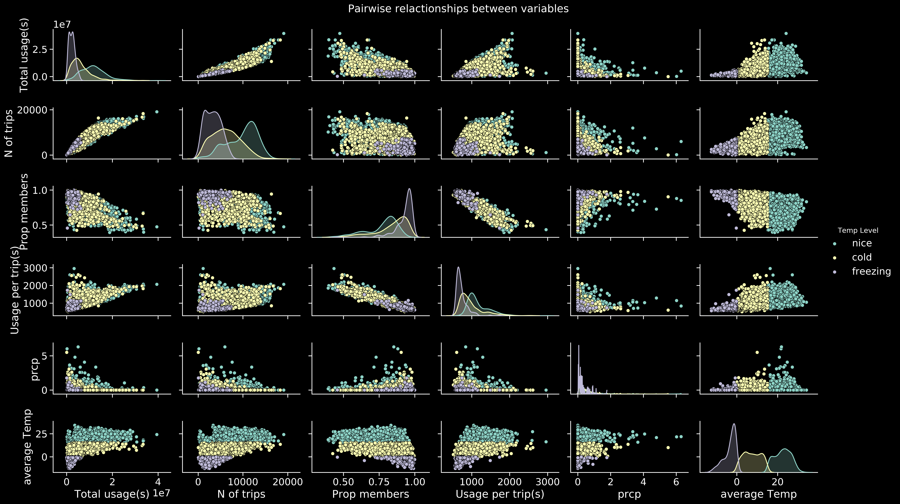
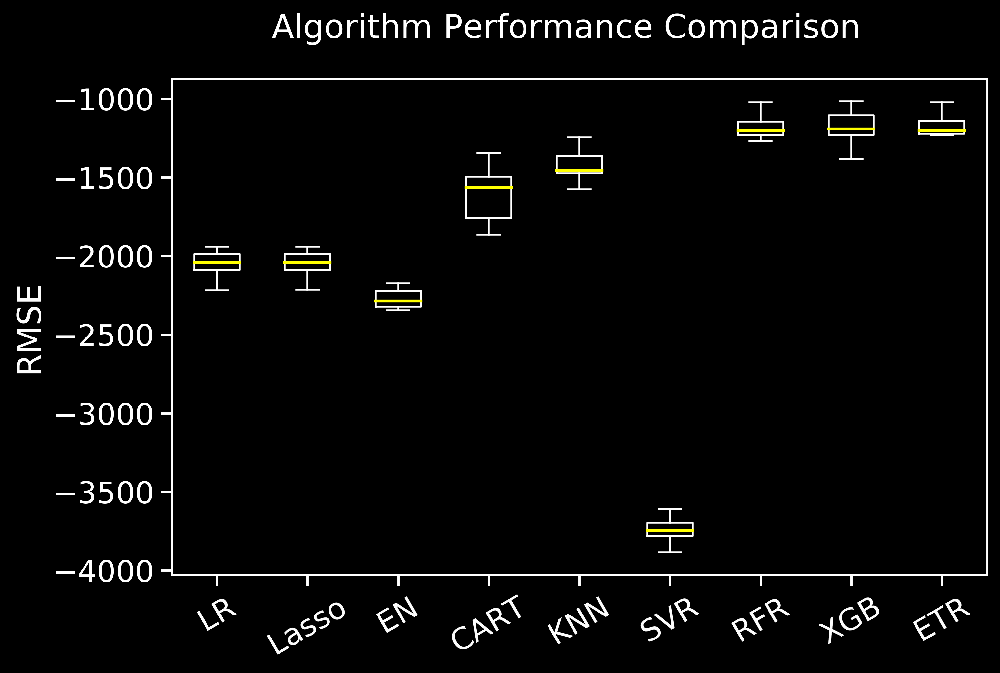
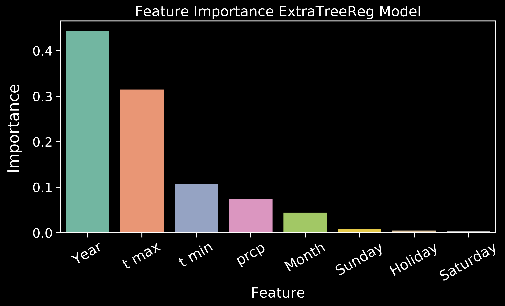

# Predicting Rental Bike Usage: An end to end project

**Description**: I will be using a dataset containing information from a bicycle rental company called capital bikeshare located in Washington D.C founded in 2010. 
The aim is to use the [data from the past 10 years](https://www.capitalbikeshare.com/system-data) to develop a model that can predict bicycle usage (Number of trips and total time ride usage) at a given day.

* **Combined and prepared** all company **data** into a single file containing the number of trips and total time usage for each day a total period of 10 years.
* Further complemented this data with [weather data](https://kilthub.cmu.edu/articles/dataset/Compiled_daily_temperature_and_precipitation_data_for_the_U_S_cities/7890488)(temperature and precipitation) 
and [US federal holidays](https://docs.opendata.aws/noaa-ghcn-pds/readme.html).

* **Exploratory Data Analyses** were carried out to study the patterns on bike usage. This allowed to select the most relevant attributes for modelling.

* Study **model performace** for a list of algorithms. 
For this cross-validation was performed and neg_mean_squared_error was used as metric of model performance.

* Fine **tuned** the most promissing models by using GridSearchCV.

* Created a **pickle** file for the machine learning model.

# Code and Resources Used

**Python Version**: 3.7

**Packages**: pandas, numpy, datetime, os, sklearn, matplotlib, seaborn, plotly.express, pickle and json.

# 1. Obtain and Prepare the data:

* Combined all data into a single csv file (27 million rows)
* Used a **pivot table** to extract total usage time, total bikes used and proportion of members for each day. Consequently the resulting dataframe was reduced to a total of 3477 rows.
* Added **weather** (t max, tmin and precipitation) and **holiday** information for each day.
* **Feature enginnering**: Created some new categorical variables based on the data such rain, temperature and membership level (high, medium,low), and date related variables such the day of the week.

# 2. Exploratory Data Analyses:

* Looked for **time patterns** in the data. 

For instance we observed a **yearly pattern** of bike usage that seems to be linked to the temperature (See figure below):

 

Also **weekly patterns** were found, where weekends stand out as the most busy and recording the longest rental trips as expected:

 

* Studied **pair-wise** relactionships and **correlation** beetween variables to select the most relevant features for the model.

 

# 3. Data preprocessing, split and standarization:

* Attributes chosen for modeling: 
  * Numerical: "prcp" (precipitation), "t max", "t min", "Year" and "Month"
  * Classification: "Holiday"(boolean) and "Week day"(Monday to Sunday)
* Categorical variables were transformed into dummy variables. 
* Data was splitteed using **StratifiedShuffleSplit** to guarantee an even distribution after splitting the data. Test size chosen was 20%.
* **Standarization** was performed using StandardScaler on the train set, and the scaler was then used on the test set. This helped minimizing the differences of scale among variables, hence resulting in better modeling.

# 4. Model Performance

 * Model performace of a variety of regression algorithms (Linear Regression,Lasso,Elastic Net,Decision Tree Regressor,K Neighbors Regressor, Support Vector Machine Regressor, 
Random Forest Regressor, Gradient Boosting Regressor, ExtraTreesRegressor and Xtreme Gradient Boost Regressor) was assessed using **cross-validation** with 10 splits, and **negative mean squared error** as performance metric.

Performance of these algos, summarized in the plot below, suggested the **Gradient Boost Regressor(GBR)** as the best algo candidate:

 

# 5. Fine tunning, model evaluation and export:

* The GBR model was fine tunned using GridSearchCV. The following hyperparameters were optimized to maximiza the model performance in both the train and test set while avoiding overfitting:
    * Learning rate
    * Max_depth
    * n_estimators
    * min_sample_leaf
 * **Score**: The model GradientBoostingRegressor(learning_rate=0.05, n_estimators=120, max_depth=6, min_samples_leaf=14) allowed to predict the **total amount of bike usage** at a given day
 with a score of 0.94 and **0.90** on the train and test set respectively.
 * The model was saved in pickle format for future use.
 
 Steps 3 to 5 were repeated to train a model able to predict the **number of bike trips** at a given day. In this case the best model was:
 **ExtraTreesRegressor**(n_estimators=50, max_depth=10, min_samples_leaf=2) with a score of **0.90** on the test set.
 
 The feature importance for this model are shown below:
 
  
 
 

